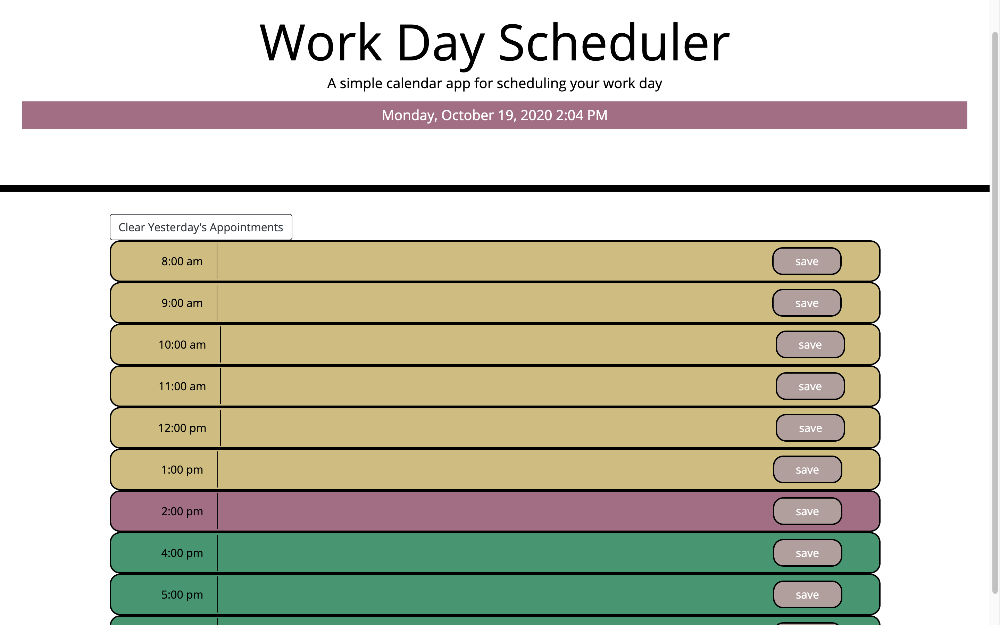

# My Workday Scheduler

_Homework #5 for UofU Full-Stack Developer Bootcamp_


This project was created to satisfy these requirements:

## User Story

```
AS AN employee with a busy schedule
I WANT to add important events to a daily planner
SO THAT I can manage my time effectively
```

## Acceptance Criteria

```
GIVEN I am using a daily planner to create a schedule
WHEN I open the planner
THEN the current day is displayed at the top of the calendar
WHEN I scroll down
THEN I am presented with time blocks for standard business hours
WHEN I view the time blocks for that day
THEN each time block is color-coded to indicate whether it is in the past, present, or future
WHEN I click into a time block
THEN I can enter an event
WHEN I click the save button for that time block
THEN the text for that event is saved in local storage
WHEN I refresh the page
THEN the saved events persist
```

We were provided with starter HTML and CSS.

## Operating Instrucions:

Upon page load, the user is provided with a block for each hour of the standard workday.

- Click inside the boxes and type in appointments.
- _a textarea box appears to collect your appointment data_
- Click the save button
- _your appt is stored in local storage_
- To clear previous appointments and start a new day, click "Clear Yesterday's Appointments"
  - _local storage is cleared and page is reloaded_
